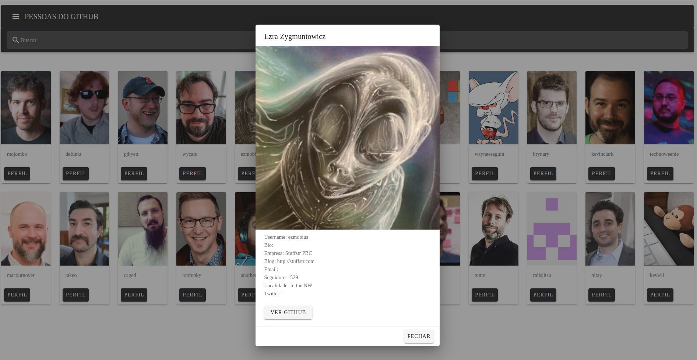

# vue-users (NUXTjs e Vuetify)

### permite ver usuarios através da api do git hub

* lista de todos usuarios com paginação 

* clicando em um usuario especifico e ver detalhes do perfil

### tecnologias 
 * NuxtJS e Vuetify

### instruções para uso

`npm install`

`npm run build`

***THANKS !!!***

